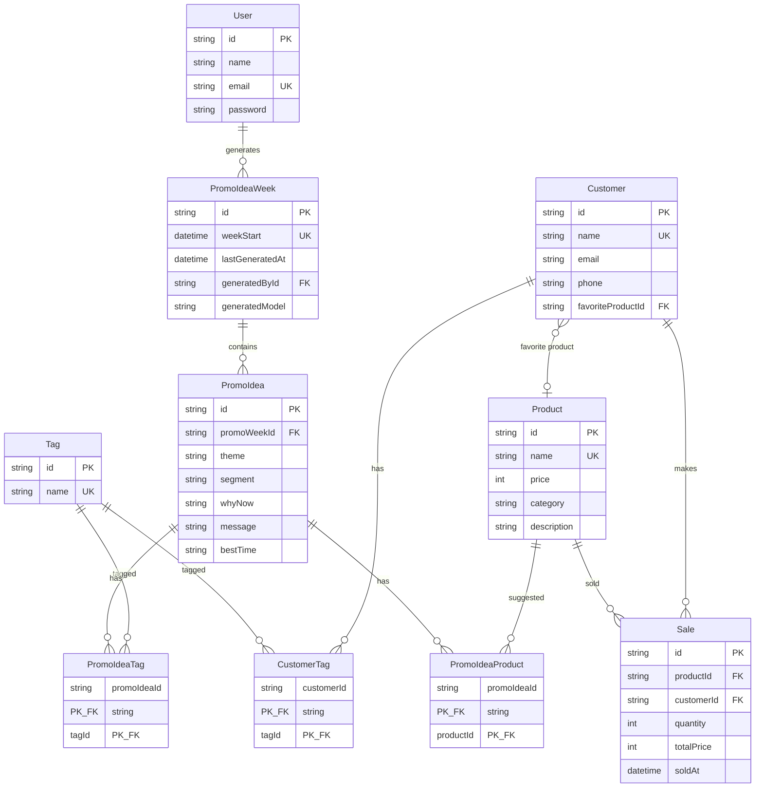
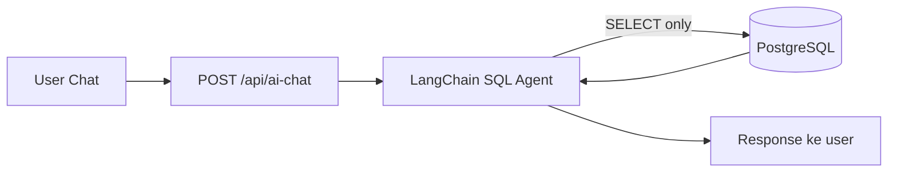
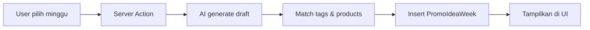
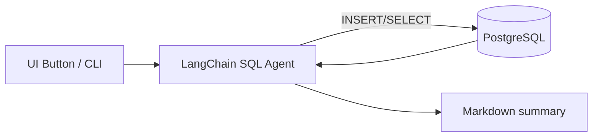

# Kopi Kita — Mini CRM

Aplikasi Mini CRM untuk kedai kopi **Kopi Kita**. Dibangun sebagai submission untuk posisi Fullstack Engineer di PlabsID.

## Tech Stack

- **Framework**: Next.js 16 (App Router, React 19, Turbopack)
- **Database**: PostgreSQL + Prisma 7
- **Auth**: NextAuth v5 (Credentials, JWT)
- **AI**: LangChain + SQL Agent (OpenAI-compatible API)
- **UI**: Tailwind CSS v4 + [Neobrutalism Components](https://neobrutalism.dev)
- **Package Manager**: bun

## Fitur

| Modul | Deskripsi |
|-------|-----------|
| Login | Autentikasi email/password, session JWT, redirect otomatis |
| Dashboard | Statistik utama (total customer, produk, sales, revenue), top interests |
| Customers | CRUD customer, filter by tag, relasi favorite product (select + creatable) |
| User Management | CRUD user admin, search by nama/email |
| Tags | CRUD interest tag, quick-add inline, search, warna tag unik per nama |
| Products | CRUD produk (nama, harga, kategori, deskripsi), sortable + pagination table |
| Sales | CRUD sales (produk, customer opsional, qty, total, soldAt), sortable + date filter |
| Charts | Visualisasi penjualan (revenue trend, top products, distribusi tag) dengan filter range/date |
| Promo Ideas | Generate rekomendasi promo mingguan via AI agent, library semua ide, riwayat per minggu |
| AI Chatbot | Chat interaktif dengan LangChain SQL Agent untuk analisis data CRM secara real-time |
| Generate Dummy | Generate dummy data via AI agent (melalui UI atau CLI), pilih mode: new/existing/mixed |

## Data Model



Junction tables `CustomerTag`, `PromoIdeaTag`, `PromoIdeaProduct` digunakan untuk relasi many-to-many secara eksplisit.

## Struktur Folder

```
src/
├── app/
│   ├── api/
│   │   ├── ai-chat/              # AI Chatbot route handler (LangChain SQL Agent)
│   │   ├── auth/[...nextauth]/   # NextAuth route handler
│   │   └── generate-dummy/       # Generate dummy data via AI agent
│   ├── ai-chat/                  # AI Chatbot page + generate dummy UI
│   ├── charts/                   # Sales charts + analytics
│   ├── customers/                # Customers management (CRUD + filter)
│   ├── dashboard/                # Dashboard home (stats + top interests)
│   ├── login/                    # Login page + server action
│   ├── products/                 # Products management (CRUD)
│   ├── promo-ideas/              # Promo ideas generator (AI)
│   ├── sales/                    # Sales management (CRUD)
│   ├── tags/                     # Tags management (CRUD)
│   └── users/                    # User management (CRUD)
├── components/ui/                # Neobrutalism shadcn components
├── hooks/
│   └── use-before-unload.ts      # Prevent page leave during AI processing
├── lib/
│   ├── auth.ts                   # NextAuth config + authorize
│   ├── auth.config.ts            # NextAuth callbacks (JWT/session)
│   ├── ai-chat.ts                # Read-only LangChain SQL Agent for chatbot
│   ├── dummy-agent.ts            # Write-enabled SQL agent for dummy data gen
│   ├── sql-agent.ts              # Shared SQL agent utilities (TypeORM, tools)
│   ├── promo-ideas.ts            # Promo idea generation logic
│   ├── date-utils.ts             # Shared date parsing helpers
│   ├── require-auth.ts           # Shared authentication guard
│   ├── prisma.ts                 # Prisma singleton
│   └── database-url.ts           # DB URL normalizer
├── types/
│   └── next-auth.d.ts            # Session type augmentation
└── middleware.ts                  # Route protection
prisma/
├── schema.prisma                 # Data model (User, Customer, Tag, Product, Sale, PromoIdea, junction tables)
├── seed.ts                       # Seed: admin, tags, products, customers, sales (upsert-based)
└── generate-ai-dummy-agent.ts    # CLI dummy data generator via LangChain SQL Agent
```

## AI Architecture

Aplikasi ini menggunakan **3 fitur AI** yang semuanya berjalan di atas LangChain SQL Agent:

### 1. AI Chatbot (Read-Only)



- Agent hanya bisa `SELECT` — read-only, aman dari mutasi
- Menjawab pertanyaan analisis CRM berdasarkan data aktual
- Conversation history dikirim untuk konteks

### 2. Promo Ideas Generator



- AI menganalisis data customer + produk untuk menghasilkan ide promo
- Hasil di-persist ke database sebagai `PromoIdeaWeek` + `PromoIdea`
- Tag dan produk yang disebut AI di-match ke data existing

### 3. Dummy Data Generator (Write-Enabled)



- Agent bisa `INSERT` + `SELECT` — untuk generate data realistis
- DDL diblokir untuk keamanan
- 3 mode: `new`, `existing`, `mixed`
- Bisa dijalankan via UI (halaman AI Chat) atau CLI

## Setup

### 1. Install dependencies

```bash
bun install
```

### 2. Environment variables

```bash
cp .env.example .env
```

Edit `.env` — isi `DATABASE_URL` dengan connection string PostgreSQL (bisa pakai [Neon](https://neon.tech) gratis), generate `AUTH_SECRET`, lalu set AI config:

```bash
openssl rand -base64 32
```

Contoh AI config (NVIDIA NIM / OpenAI-compatible):

```env
AI_API_KEY="..."
AI_BASE_URL="https://integrate.api.nvidia.com/v1"
AI_MODEL="meta/llama-3.1-8b-instruct"
```

### 3. Setup database

```bash
bun prisma generate
bun prisma migrate dev
```

### 4. Seed data

```bash
bun prisma db seed
```

Akan membuat:
- 1 akun admin: `admin@kopikita.com` / `password123`
- 14 sample tags
- 6 sample products
- 6 sample customers (dengan relasi favorite product + interest tags)
- 8 sample sales records (soldAt tersebar untuk kebutuhan analytics)

### 5. Jalankan dev server

```bash
bun dev
```

Buka [http://localhost:3000](http://localhost:3000) — akan redirect ke halaman login.

## Login Default

| Email | Password |
|-------|----------|
| admin@kopikita.com | password123 |

## Scripts

| Command | Deskripsi |
|---------|-----------|
| `bun dev` | Development server (Turbopack) |
| `bun run build` | Production build |
| `bun start` | Start production server |
| `bun lint` | ESLint |
| `bun prisma generate` | Generate Prisma client |
| `bun prisma migrate dev` | Apply migrations |
| `bun prisma db seed` | Seed database |
| `bun run dummy:ai:agent` | Generate dummy data via CLI (LangChain SQL Agent) |
| `bun prisma studio` | Buka Prisma Studio (GUI) |

### AI Dummy Data Generator

```bash
# Mode mixed (default): gabung data lama + data baru AI
bun run dummy:ai:agent

# Mode existing: hanya tambah sales, reuse data yang sudah ada
bun run dummy:ai:agent --mode=existing

# Mode new: buat data baru (tags, products, customers, sales)
bun run dummy:ai:agent --mode=new
```

Bisa juga dijalankan dari UI di halaman **AI Chatbot** → bagian **Generate Dummy Data**.

> **Catatan**: Tanggal `sales.soldAt` selalu di-random dalam rentang 30 hari ke belakang.

## Security

- Semua mutation server actions dilindungi `requireAuth()` — harus login
- Password di-hash dengan bcryptjs (cost factor 12)
- Error messages di-sanitize — tidak leak internal error ke client
- Query dibatasi dengan `take` limit untuk mencegah unbounded fetch
- AI SQL Agent (chatbot) hanya mengizinkan `SELECT` — read-only

## Deploy

Deploy ke [Vercel](https://vercel.com) — pastikan set environment variables (`DATABASE_URL`, `AUTH_SECRET`, `AI_API_KEY`, `AI_BASE_URL`, `AI_MODEL`) di dashboard Vercel.
